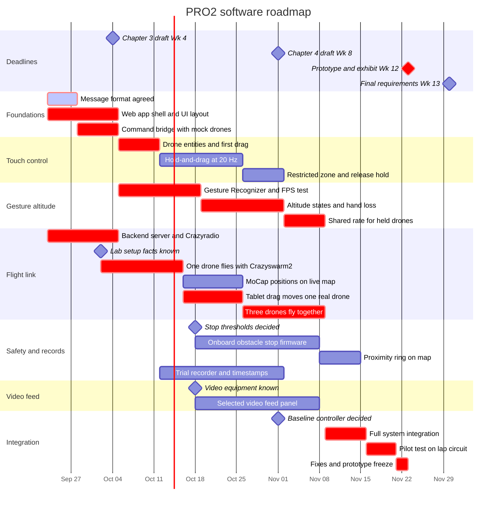

# PRO2 software roadmap

This roadmap shows how the team builds each part of the software during the PRO2 term.
It covers PRO2 only. The team will plan PRO3 after this term ends.

[CONTEXT.md](CONTEXT.md) owns the requirements, targets, and decisions. [README.md](README.md) owns the architecture and setup.
This file owns only the order and timing of the software work.

## Status on 2026-09-23

These are **Accepted project decisions**, stated on 2026-09-23.

- The team is in PRO2 Week 3. The team started work in Week 2, on 2026-09-14.
- The repository has no application code yet. All software parts start from zero.
- The drones, the radio, access to lab motion capture, and the tablet are available.

## How to read the dates

- **Proposal requirement:** The proposal Gantt charts use week groups: Wk 1–4, Wk 5–8, and Wk 9–13. Finals week 14 is not part of the plan. (PDF pp. 63–69)
- **Interpretation:** Week 1 starts on Monday 2026-09-07. Each date in this file comes from that start date.
- **Recommendation:** The exact days inside a week group are suggestions. The team can move a task earlier. No task moves past a proposal deadline.
- **Proposal requirement:** The proposal gives the backend server, Crazyradio, and WebSocket/CRTP link to the hardware team (Galvez, Romero). The software team (Villanueva, Metrillo) owns the interface and the gesture channel. (PDF pp. 64–66)

## Timeline

Red bars are on the critical path. A delay in a red bar delays the Week 12 prototype.
Diamonds are deadlines or decisions. A bar after a decision diamond cannot start until the team makes that decision.

## Software parts

Each "Done when" item is a check that the team can pass or fail. Each check comes from [CONTEXT.md](CONTEXT.md) or [README.md](README.md). The test durations are **Recommendations**.

| # | Software part | Weeks | Owner | Done when |
|---|---|---|---|---|
| 1 | **Foundations.** Agree on the message format between the tablet and the host. Build the web app shell and the UI layout: the map to scale (531 cm × 355 cm), the hand-camera panel, and a video panel placeholder. Build the Python command bridge with a mock connection that returns fake drone positions. | Wk 3–4 | Message format: both teams. Shell, layout, and mock: software team. Bridge: hardware team. | The tablet opens the app over HTTPS. The layout matches the panel roles in the proposal (PDF p. 39). The bridge accepts checked messages and returns mock positions. |
| 2 | **Touch control.** Show three drone entities on the map. Each finger holds and drags one drone. Block drags into the restricted zone. A released drone holds its position. | Wk 5–8 | Software team | Three fingers move three entities at once. Commands stream at 20 Hz or more for each held drone (TARGET-01). A drag into the restricted zone fails (REQ-02, REQ-07, REQ-08). |
| 3 | **Gesture altitude.** Run the MediaPipe Gesture Recognizer in the browser (DEC-06). Capture the neutral point on open palm. Map hand height to a climb or descent rate. Lock on closed fist. Hold altitude on hand loss. | Wk 5–9 | Software team | The tablet keeps 15 FPS or more for 5 minutes (TARGET-02). A test log shows the rate, lock, and hand-loss states (REQ-03 to REQ-06). |
| 4 | **Flight link.** Set up the backend server and the Crazyradio. Connect the host to the drones through Crazyswarm2 (REC-01). Show motion capture positions on the live map. Send a tablet drag to one real drone, then to three. | Wk 3–9 | Host and radio: hardware team. Live map: software team. | A finger drag moves one real drone. Three drones then hover together without contact. The team records a first latency estimate (TARGET-05). |
| 5 | **Safety and records.** Add onboard obstacle-stop firmware to each drone (DEC-05). Show the proximity ring on the map. Build the trial recorder with one shared clock. | Wk 6–10 | Open. Assign an owner in Week 4. | Each drone stops near an object in a bench test (REQ-10). One trial file holds commands, positions, events, and timestamps (REQ-18). |
| 6 | **Video feed.** Show one selected onboard video feed. Changing the feed does not change which drones are held (DEC-08). | Wk 7–10 | Software team | The feed plays next to the map and the hand camera, with touch and gestures active (REQ-09). |
| 7 | **Integration.** Join the interface, the gesture channel, and the three-drone team. Run the pilot test on the Miguel 409 lap circuit. Freeze the prototype. | Wk 10–12 | All members | One operator flies three drones through one full lap. The team logs errors, latency, and collisions. |

The trial recorder is in PRO2 because the pilot test needs logs.
The proposal schedules full data logging in PRO3. This earlier start is a **Recommendation**.

The proposal puts the UI layout, including the video panel, in Wk 1–4 (PDF p. 64). The live feed waits for the equipment.

## Decisions that block work

Each date below is a **Recommendation**. If a decision is late, the bars after it move later on the chart.

| Decision | Blocks | Decide by | Source |
|---|---|---|---|
| Message fields, units, and limits between the tablet and the host. The software team accepted version 1 on 2026-09-27. Hardware team review is pending. | Parts 1, 2, 3, and 4 | 2026-09-28 | [DEC-11](CONTEXT.md#accepted-decisions-made-after-the-proposal), [protocol/README.md](protocol/README.md) |
| Motion capture vendor, flight host, and radio model | Part 4 | 2026-10-02 | [OPEN-08](CONTEXT.md#unknowns-contradictions-and-open-decisions) |
| Obstacle-stop thresholds, clear rules, and affected axes | Part 5 firmware | 2026-10-18 | [OPEN-04, OPEN-05](CONTEXT.md#unknowns-contradictions-and-open-decisions) |
| Onboard video camera and receiver | Part 6 | 2026-10-18 | [OPEN-09](CONTEXT.md#unknowns-contradictions-and-open-decisions) |
| Latency events, clocks, and error calculations | Part 5 recorder | 2026-10-25 | [OPEN-12](CONTEXT.md#unknowns-contradictions-and-open-decisions) |
| Baseline controller model and button mapping | Pilot test and PRO3 trials | 2026-11-01 | [OPEN-11](CONTEXT.md#unknowns-contradictions-and-open-decisions) |

## Deadlines

| Deadline | Proposal week | Date range (Interpretation) |
|---|---|---|
| Chapter 3 draft to the adviser | Wk 1–4 | By 2026-10-04 |
| Chapter 4 draft to the adviser | Wk 5–8 | By 2026-11-01 |
| Optional petition for change of objectives | Wk 9–10 | 2026-11-02 to 2026-11-15 |
| Thesis exhibit, thesis prototype, and peer feedback form | Wk 12 | 2026-11-23 to 2026-11-29 |
| Final requirements, Chapters 1–5 | Wk 13 | 2026-11-30 to 2026-12-06 |

Source: proposal Gantt Charts 1 and 2, PDF pp. 64–66.

## Risks

| Risk | Recommendation |
|---|---|
| The late start leaves only 11 days in the Wk 1–4 group. | Build the mock path first. Then the interface work does not wait for flight hardware. |
| Three-drone flight fails late. The proposal puts the motion capture test in Wk 9–13. | Fly one drone under motion capture in Wk 5–8. |
| The tablet cannot run gestures at 15 FPS. | Measure the frame rate on the real tablet in Week 5. Run the recognizer in a web worker. |
| The video equipment is still unknown. | Keep part 6 off the critical path. If the equipment is not known by 2026-10-18, tell the adviser. The feed is a proposal requirement (REQ-09). |

## Updates

Update the status and the chart each week. When the team makes a decision, record it in [CONTEXT.md](CONTEXT.md) and move its diamond here.
